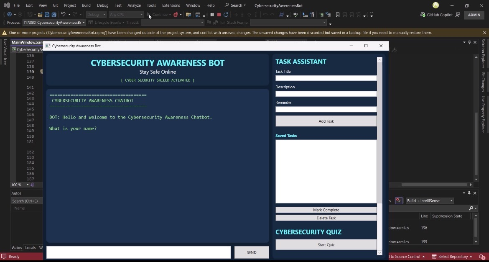

# Cybersecurity Awareness Chatbot

## Project Description

The Cybersecurity Awareness Chatbot is a WPF desktop application developed in C#. The purpose of the application is to educate users about cybersecurity topics such as phishing, password security, malware, privacy, safe browsing, social engineering, and two-factor authentication.

The chatbot uses keyword recognition, sentiment detection, task management, a cybersecurity quiz, and activity logging to create an interactive learning experience.

---

## Student Information

- Name: Inganathi Mancam
- Student Number: ST10484781
- Module: PROG6221 Programming 2A

---

## Features Implemented

## Part 1 Features

* Cybersecurity awareness chatbot
* Keyword recognition
* Randomised responses
* User name recognition
* Conversation memory
* Sentiment detection

## Part 2 Features

* Graphical User Interface (GUI) using WPF
* Enhanced chatbot interaction
* Improved user experience

## Part 3 Features

### Task Assistant

* Add cybersecurity tasks
* Add task descriptions
* Add reminders
* Mark tasks as completed
* Delete tasks
* Store tasks using JSON

### Cybersecurity Quiz

* Multiple cybersecurity questions
* Immediate feedback
* Score tracking
* Final results display

### NLP Simulation

* Recognises different user requests
* Detects quiz requests
* Detects task requests
* Detects reminder requests
* Detects activity log requests

### Activity Log

* Records tasks added
* Records task completion
* Records task deletion
* Records quiz activity
* Records chatbot actions

### GitHub Features
- GitHub Actions CI workflow
- Multiple commits
- Tagged releases

---

## Cybersecurity Topics Supported

The chatbot can respond to questions about:
- Password safety
- Phishing
- Malware
- Online scams
- Privacy
- Hacking
- Safe browsing
- Social media safety
- Two-factor authentication
- Cybersecurity awareness

---

## Technologies Used

* C#
* WPF
* XAML
* JSON File Storage
* Object-Oriented Programming

---

## How to Run the Application

### Prerequisites

Install the following:
- Visual Studio 2022
- .NET 8 SDK
- Windows Operating System

---

# Required NuGet Package

## Install Newtonsoft.Json:

Tools → NuGet Package Manager → Manage NuGet Packages for Solution

Search for:

Newtonsoft.Json

Install the latest stable version.

___

### Steps to Run

1. Open the solution in Visual Studio.
2. Build the solution.
3. Run the application.
4. Interact with the chatbot using the GUI.

---

## WAV File Setup

The `greeting.wav` file must be placed inside the project output folder for the voice greeting to work correctly.

Make sure the file property is set to:

```plaintext
Copy to Output Directory = Copy Always
```

---

## Screenshot of Application



---

## GitHub Actions CI

The project uses GitHub Actions for Continuous Integration.


---
## Video Presentation

[Watch the Video Presentation](https://github.com/inganathi-jpg/CybersecurityChatBot/blob/master/Video/ChatBot%20Presentation.mp4)

---

# JSON Storage

Tasks are automatically stored in:

tasks.json

The file is created automatically when the first task is added.

---

# GitHub Releases

v3.0

* Task Assistant completed
* JSON storage implemented

v3.1

* Quiz feature added
* Activity Log implemented

v3.2

* NLP Simulation completed
* Final integrated version
  
---
## Project Structure

# Cybersecurity Awareness Chatbot

## Project Structure

```text
CybersecurityAwarenessBot
│
├── CybersecurityAwarenessBot.sln
│
├── CybersecurityAwarenessBot
│   ├── App.xaml
│   ├── App.xaml.cs
│   ├── MainWindow.xaml
│   ├── MainWindow.xaml.cs
│   │
│   ├── ChatBot.cs
│   ├── KeywordResponder.cs
│   ├── SentimentDetector.cs
│   ├── MemoryStore.cs
│   │
│   ├── TaskManager.cs
│   ├── TaskStorageHelper.cs
│   ├── CyberTask.cs
│   │
│   ├── QuizManager.cs
│   ├── QuizQuestion.cs
│   │
│   ├── ActivityLogger.cs
│   ├── AudioPlayer.cs
│   │
│   ├── greeting.wav
│   ├── tasks.json
│   │
│   ├── Properties
│   └── CybersecurityAwarenessBot.csproj
│
├── README.md
│
├── Screenshots
│   ├── chatbot.png
│   ├── taskassistant.png
│   ├── quiz.png
│   └── activitylog.png
│
└── Documentation
    ├── POE_Report.pdf
    └── Presentation.pdf
```

---

## GitHub Repository

Repository Link:

https://github.com/inganathi-jpg/CybersecurityChatBot

---

## Author

Developed by Inganathi Mancam for PROG6221 Programming 2A.
